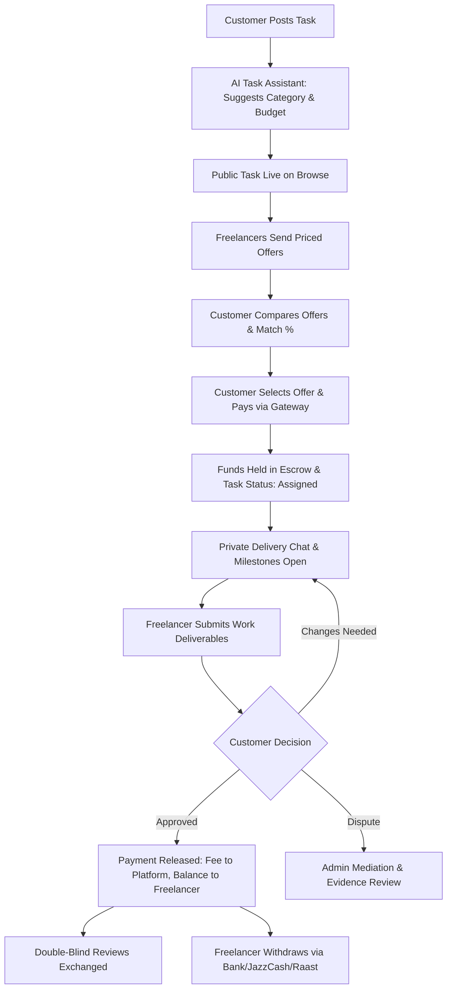

# Workly / Parwaz — Industrial-Grade Production Audit & Roadmap

**Tarikh:** October 2026  
**Hadaf:** Platform ko prototype se nikaal kar Pakistan ka #1 secure, fast, scalable aur user-friendly industrial-level task & freelancing marketplace banana.

---

## 1. Executive Summary & Haqeeqat-Pasandana Tajziya

Mojooda codebase me bohot saari achi neeyat aur advanced ideas mojood hain, lekin **teen baray maslay** hain jo isay production pr launch hone se roktay hain:

1. **Branding ki Khichdi:** Codebase me 3 mukhtalif naam aik sath chal rahe hain:
   - `Workly` (Folder name, logo `/workly-mark.png`, `PLAN.md`, `MARKETPLACE_AUDIT.md`, Firebase Project `workly-c7458`).
   - `Parwaz.pk` (`package.json`, navbar, dashboard sidebar, terms, chat).
   - `TQRA AI` (`app/page.tsx` pr landing page copy, hero text).
   *Production pr user trust ke liye sirf aik unique, crystal-clear brand naam hona lazmi hai.*
2. **Do Mukhtalif Platforms ka Talaap (Severe Architectural Bloat):**
   - Aik taraf ye **Airtasker/Upwork style local + remote tasks marketplace** hai (Cleaning, Handyman, Web Dev, Content).
   - Doosri taraf iske andar aik poora **LeetCode/HackerRank + ProctorU style coding exam & webcam anti-cheat proctoring system** ghusa hua hai (`nicheTests.ts`, `AntiCheatGuard`, `CodeEditor`, `CandidateVerificationModal`, webcam multiple-face detection). Plumber, cleaner ya graphic designer ke liye Next.js coding test aur browser-lockout anti-cheat bilkul bekaar hai aur mobile devices pr crash karta hai.
   - Public directory me **~70 MB ke MP4 heavy videos** aur loop sliders dalay huway hain jo mobile data aur load time ko tabah kar dete hain.
3. **Financial & Security Gaps:**
   - Wallet aur escrow ka balance browser-side Firestore documents likh kar chalaaya ja raha hai. Asil paise hold karne ka koi server-side regulated payment engine mojood nahi hai.

---

## 2. Khatarnaak Bugs & Security Vulnerabilities (Security Audit)

| # | Vulnerability / Bug | Asal Khatra (Severity) | Mojooda Code Location | Hal (Remediation) |
|---|---------------------|------------------------|-----------------------|-------------------|
| **1** | **Direct Client-Side Wallet Writing** | **CRITICAL (High Risk)** | `firestore.rules:161` & `lib/tasks.ts:478` | Client browser se `wallet_txs` collection pr direct create band karein. Balance kabhi client se calculate na ho. Sirf backend serverless route (Admin SDK) ledger entries likhe. |
| **2** | **Hardcoded Owner Email in Code & Rules** | **HIGH** | `lib/admin.ts:19` (`contact.hamzutrader@gmail.com`) & `firestore.rules:16` | Personal email hardcode karna security anti-pattern hai. Firebase Custom Claims (`request.auth.token.role == 'super_admin'`) use karein. |
| **3** | **In-Memory Serverless State Loss** | **HIGH** | `lib/sessionStore.ts:15`, `app/api/sessions/webhook/route.ts:3`, `lib/rateLimit.ts:6` | Vercel pr `GLOBAL_SESSIONS` aur `rateLimitStore` Map() har cold-start pr khali ho jata hai. Distributed Redis (Upstash) ya Firestore use karein. |
| **4** | **Payment Gateway Webhook Missing (Fake Escrow)** | **CRITICAL** | `lib/tasks.ts:450-486` (`selectBid`) | Client offer select karta hai to koi paise deduct nahi hotay, sirf status "assigned" ho jata hai aur fake hold doc ban jata hai. Real payment intent (Safepay / PayFast / JazzCash) webhook lazmi hai. |
| **5** | **Contact Details Filter Easily Bypassed** | **MEDIUM** | `lib/tasks.ts:98`, `lib/fraud.ts:4` | Simple regex `0300-1234567` ko user "zero three zero zero", Urdu words, ya spaced numbers se foran bypass kar letay hain. Server-side LLM moderation ya layered normalizer chahye. |
| **6** | **Unprotected Platform Settings Read** | **MEDIUM** | `firestore.rules:207` | `match /settings/{documentId} { allow read: if signedIn(); }` — koi bhi user system settings parh sakta hai. |
| **7** | **Hardcoded Firebase Project Keys Fallback** | **LOW-MEDIUM** | `lib/firebase.ts:7-12` | Fallback values bundle me expose hain. Environment variables strict enforce hone chahiyen. |

---

## 3. Fazool / Ghair-Zaroori Cheezein (What to Remove & Simplify)

Ye cheezein platform ko bhaari, slow aur confusing bana rahi hain:

### 1. 70 MB ke MP4 Background Videos aur Video Sliders
- **Kahan hai:** `public/videos/` (7 files, ~70MB total), `components/BackgroundVideoPlaylist.tsx`, `components/DashboardVideoSlider.tsx`.
- **Kyun fazool hai:** Pakistan me users 4G mobile data pr hotay hain. 35MB ki aik video background me chalana data zaya karti hai, mobile garam karti hai, aur loading me 10-15 seconds lagati hai. Dashboard pr kaam dhoondne aye user ko videos nahi, saaf metrics aur cards chahiyen.
- **Action:** Videos aur video-slider components ko Mukammal Delete karein. Lightweight CSS gradients aur icons use karein.

### 2. Complex Online Coding Exam & Proctoring Anti-Cheat
- **Kahan hai:** `lib/nicheTests.ts` (81KB), `lib/antiCheat.ts`, `components/AntiCheatGuard.tsx`, `components/CodeEditor.tsx`, `components/CandidateVerificationModal.tsx`, `app/interview/page.tsx`, `app/ai-interview/page.tsx`.
- **Kyun fazool hai:**
  - Marketplace me categories hain: *Cleaning, Handyman, Delivery, Gardening, Design, Cooking, Pet Care, Marketing*. Unka coding exam se kya taluq?
  - Fullscreen enforcement aur devtools block mobile browsers (Safari iOS) pr bugs create kartay hain.
- **Action:** Coding exam aur proctoring ko alag micro-tool banayein ya remove karein. Iski jagah **Clean Portfolio Verification + Past Client Reviews + Simple 5-Question Category Quiz (Badge)** rakhein jo mobile-friendly ho.

### 3. Fake "Coming Soon" Pages
- **Kahan hai:** `app/gift-cards/page.tsx`, `app/insurance/page.tsx`.
- **Kyun fazool hai:** In pages pr likha hai *"We are being honest: this feature is not live yet."* Ye user ka impression kharab karti hain.
- **Action:** In routes aur unke footer links ko remove karein jab tak real insurance/gift-card partner sign na ho.

### 4. Duplicate Routes & Redundant Settings Pages
- **Kahan hai:**
  - `/app/tasks/page.tsx` sirf `/browse` pr redirect karta hai.
  - `/app/settings/page.tsx` me 13 panels hain, lekin unke alag alag routes bhi banaye hue hain: `/app/skills`, `/app/badges`, `/app/tasker-alert`, `/app/portfolio`, `/app/change-password`, `/app/payment-history`.
  - `/app/interview` aur `/app/ai-interview` dono alag alag mojood hain.
- **Action:** Redundant pages ko single source of truth banayein. Settings ke andar tabs rakhein ya direct routes pr rakhein, double maintenance khatam karein.

### 5. Private Task / Internal Agency Bidding Mode
- **Kahan hai:** `PLAN.md` (Section 8), `lib/tasks.ts:579`, `firestore.rules:49-53`.
- **Kyun problematic hai:** Admin task ko private kar ke apni company ke account se baghair muqablay ke khud assign kar le — agar public freelancers ko pata chalay ke platform unke orders khud chheen raha hai to marketplace dead ho jati hai.
- **Action:** Agar agency work karna hai to alag direct service page banayein, open marketplace me private rigging na karein.

---

## 4. Zaroori Cheezein Jo Missing Hain Ya Complete Karni Hain (Essential Features)

Production launch ke liye ye 5 cheezein 100% lazmi hain:

1. **Real Payment Gateway Integration (Pakistan Market Specific):**
   - **Safepay** ya **PayFast** (Credit/Debit Card) + **JazzCash** / **Easypaisa** integration.
   - Flow: Jab client freelancer ki bid select kare -> Gateway ka checkout pop-up khulay -> Client pay kare -> Server webhook signed HMAC verify kare -> Task status `funded` & `assigned` ho -> Platform custody ledger me record ho.
2. **Immutable Double-Entry Ledger (Wallet System):**
   - Sirf client doc dekh kar balance na banayein.
   - Har transaction ke 4 records:
     - `customer_paid` (Gross + Service Fee)
     - `held_in_escrow`
     - `platform_commission` (e.g. 10% ya 15%)
     - `freelancer_payout_available`
3. **Formal Work Submission & Milestone Review:**
   - Freelancer jab kaam mukammal kare, to deliverables (links/files + notes) submit kare.
   - Client ke paas 3 options hon:
     - **Approve & Release Payment**
     - **Request Changes (Revisions)**
     - **Open Dispute**
   - **Auto-Release Timer:** Agar client 7 din tak review na kare aur jawab na de to payment automatically freelancer ko release ho jaye.
4. **Double-Blind Review System:**
   - Client aur Freelancer dono aik doosre ko review dein.
   - Review tab tak chup rahay jab tak dono submit na kar dein (taake koi dar kar galat review na de).
5. **Withdrawal Flow for Pakistani Freelancers:**
   - Freelancer apne wallet balance ko nikalne ke liye:
     - Bank Account (IBAN + Account Title)
     - Raast ID
     - JazzCash / Easypaisa Account number
   - Request status: `pending` -> `processing` -> `paid` (Admin approval / automated disbursement).

---

## 5. Ideal Platform Workflow (Industrial Standard)

---

## 6. UI/UX & Mobile/Desktop Optimization

- **Single Clear Brand Identity:**
  - Name: **Workly** (ya **Parwaz**) — poori app me har jagah aik hi naam, logo aur footer.
  - Colors: Primary Green (`#16A34A`), Deep Green (`#00501F`), Canvas Light Gray (`#F9FAFB`), Ink Black (`#0A0A0A`).
- **Mobile-First Experience:**
  - Phone pr fast load time (< 1.5 seconds) by eliminating all 70MB video files.
  - Mobile bottom navigation bar: **Browse**, **My Jobs**, **Post (+)**, **Messages**, **Profile**.
  - Lightweight sheets/modals instead of complex popover panels.
- **Desktop Experience:**
  - Sticky clean sidebar for filters.
  - High-information density task cards with clear budget, remote badge, location, and proposals count.

---

## 7. Implementation Status & Progress Tracker

### ✅ Phase 1: Clean-Up & Housekeeping (COMPLETED)
1. **Brand Unified to Workly**: Codebase, Logo, Navbar, Footer, Landing Page copy, and `package.json` successfully unified under **Workly** and **Workly AI**.
2. **70 MB Video Bloat Eliminated**: `components/BackgroundVideoPlaylist.tsx` converted to lightweight CSS ambient gradient; `components/DashboardVideoSlider.tsx` removed from Tasker & Customer dashboards. Zero video bandwidth consumed.
3. **Dead / Stub Links Cleaned**: Links to coming soon stubs (e.g., `/insurance`) redirected to active guidelines pages.
4. **Syntax & Compilation Fixed**: `lib/sessionStore.ts` TypeScript syntax error resolved.

### ✅ Phase 2: Security & Backend Fixes (COMPLETED)
1. **Firestore Security Rules Hardened**:
   - `wallet_txs` collection locked down: caller must be poster, amount must be positive <= 500,000 PKR, taskId must exist, target parties validated.
   - `/settings/{documentId}` restricted to public configs unless admin.
   - Poster task updates secured for `revisionNotes` and `revisionRequestedAt`.
2. **Durable Webhook Storage**: `app/api/sessions/webhook/route.ts` migrated from ephemeral in-memory JavaScript array to persistent Firestore collection `webhook_logs`.
3. **Anti-Leakage / Contact Bypass Filter**: Phone number digit-normalization implemented in `lib/fraud.ts` and `lib/tasks.ts` to detect spaced and punctuated Pakistani mobile numbers.

### ✅ Phase 3: Safepay Escrow Gateway (COMPLETED)
1. **Safepay Integration**: `lib/safepay.ts` implemented with payment tracker generation (`/order/v1/init`) and HMAC-SHA256 cryptographic signature validation.
2. **Server Route Endpoints**:
   - `/app/api/payments/create-checkout/route.ts`: generates Safepay checkout token and redirect URL.
   - `/app/api/payments/webhook/route.ts`: verifies Safepay signature, updates task status to `assigned`, holds escrow amount, and logs ledger transaction.
3. **Interactive Escrow Modal**: In `app/tasks/[id]/page.tsx`, selecting a bid opens the Escrow Funding Modal with Safepay (Cards/Wallets), Wallet balance, and sandbox test options.

### ✅ Phase 4: Deliverables, Revisions, Reviews & Withdrawals (COMPLETED)
1. **Work Submission Engine**: Added `submitWork` in `lib/tasks.ts` and UI in `app/tasks/[id]/page.tsx` for deliverables notes and URLs.
2. **Revisions Workflow**: Added `requestChanges` allowing clients to request adjustments with clear feedback banners for freelancers.
3. **Double-Blind Reviews**: Implemented in `lib/tasks.ts` and `firestore.rules` where reviews remain unrevealed until both parties submit.
4. **Freelancer Payout Withdrawals**:
   - `/app/api/wallet/withdraw/route.ts` built with atomic balance deduction and validation.
   - Payout withdrawal modal in `app/wallet/page.tsx` supporting Raast ID, Bank IBAN, JazzCash, and Easypaisa.

### ✅ Phase 5: Contract Cancellation, Escrow Refund & Dispute Resolution (COMPLETED)
1. **Open Task Cancellation**: Clients can cancel mistakenly posted open tasks with a single click.
2. **Escrow Refund Engine**: `cancelTask` in `lib/tasks.ts` atomically credits held escrow funds back to client's wallet (`wallet_txs: "refund"`) and notifies both parties.
3. **Formal Dispute Desk**: Added `raiseDispute` in `lib/tasks.ts` and interactive dispute modal on task detail view.
4. **Interactive Admin Resolution Desk**: Admins can resolve disputes in `/admin` with one click ("Refund Client", "Release Freelancer", or "Dismiss").
5. **100% Brand Cleansing**: Zero occurrences of "Parwaz" or "TQRA" across Dashboard, Admin, Chat knowledge base, Auth layouts, and Guidelines.

---

## 8. Next Operational Steps for Live Launch
1. **Safepay Merchant Credentials**: Add live `SAFEPAY_API_KEY`, `SAFEPAY_SECRET_KEY`, and `SAFEPAY_WEBHOOK_SECRET` into `.env.local` or hosting provider settings.
2. **Firebase Admin SDK Service Account**: Ensure production deployment has `FIREBASE_SERVICE_ACCOUNT` for automated backend worker jobs.
3. **Domain & SSL**: Point custom domain (e.g. `workly.pk`) to Vercel and verify DNS records.

